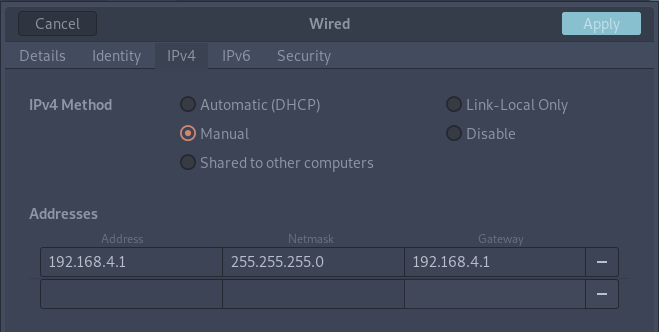
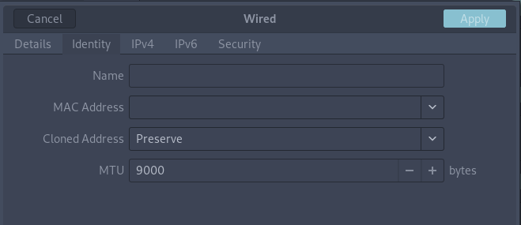

# RFSoC Data Offload
This repository contains an RFSoC4x2 reference design that enables high-speed data offload from the board to a PC/server, via the QSFP28 connection. The RF-ADC data is packetised into UDP packets using the open-source [Network Layer IP](https://github.com/xilinx/xup_vitis_network_example), and sent to the QSFP28 port via Xilinx's CMAC IP core.

## Equipment and Software Requirements
The following is a list of equipment and software used for development and testing of this design. Compatibility with any other software/equipment not listed here is not guaranteed.

### Hardware
- [RFSoC4x2 Development Board](https://www.rfsoc-pynq.io)
- [Mellanox MCX515A-CCAT Network Interface Card](https://www.fs.com/uk/products/119648.html) (NIC)
- 2x [Mellanox MMA1B00-C100D QSFP28 Transceiver](https://www.fs.com/uk/products/71009.html)
- [MTP-12 Female to Female Fibre-Optic Cable](https://www.fs.com/uk/products/69009.html?attribute=978&id=259837)
- PCIe3.0 compatible computer (with QSFP28 NIC installed)

### Software
- [PYNQ v2.7](http://www.pynq.io/board.html)
- [Jupyter-Lab](https://jupyter.org/)
- [mstflint](https://github.com/Mellanox/mstflint)

## Installation Guide
Follow the instructions below to install the data offload example for PYNQ. You will need to give your board access to the internet.
* Power on your development board with an SD Card containing a PYNQ v2.7 image.
* Navigate to Jupyter Labs by opening a browser and connecting to http://<board_ip_address>:9090/lab.
* Run the code below in a Jupyter terminal to install the RFSoC data offload overlay.
```bash

pip3 install git+https://github.com/strath-sdr/rfsoc_qsfp_offload
```
Once installation has complete you will find the package folder in the Jupyter workspace directory. The folder will be named 'rfsoc-offload'.

## Using the Project Files

The following software is required to use the project files in this repository.

* Vitis Core Development Kit 2021.1 with [Y2K22](https://support.xilinx.com/s/article/76960?language=en_US) patch applied
* Vivado Design Suite 2021.1
* Git

### Cloning the Repository
As this repo contains a submodule, clone the repo using the `--recursive` flag

```
git clone https://github.com/strath-sdr/rfsoc_qsfp_offload.git --recursive
```

### Building the Project

The Vivado project uses an external Network Layer IP repository that is included as a submodule in the `./boards/ip_repo/` directory. The Network Layer IP uses a modified version of the repository that must be patched and built before the Vivado build process begins. This is all taken care of within the Makefile in the top level directory of this repo.

To build the project, first make sure Vitis and Vivado are on your `$PATH` environment variable.

```
source <path-to-Vitis>/2021.1/settings64.sh
echo $PATH
```

Then run `make` in the top level directory.

```
make patch
make all
```

This will patch and build the Network Layer IP, build the Vivado project, and generate the bitstream and HWH files required for the overlay. 

```make patch``` needs to be run only once after the repository is cloned. ```make all``` can be re-run after ```make clean``` command is issued.

## PC/Server Setup

### PCIe slot 
Make sure to attach the QSFP NIC to an appropriate PCIe interface. Most cards require a PCIe x16 slot to fully utilize the bandwidth.

### Static IP 
To run this demo, the PC has to be setup to use a static IP for the QSFP interface.

Example using Gnome network manager interface:

<p align="center">
  
</p>

### MTU
For the best performance the Maximum Transmission Unit of the interface needs to be increased to support jumbo frames.

Example using Gnome network manager interface:

<p align="center">
  
</p>

### GNU Radio
Instructions on installing GNU Radio and preparing to run the demo can be found in [gnuradio/README.md](gnuradio/README.md).
