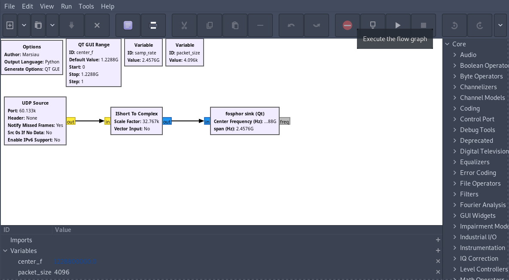
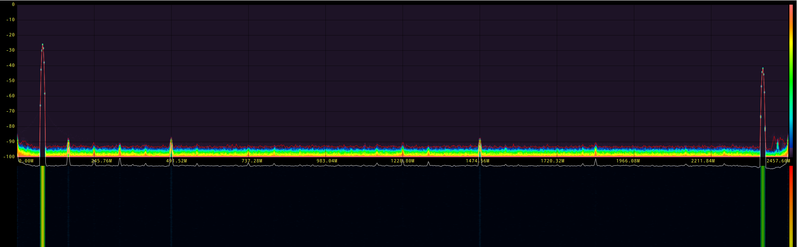

# RFSoC QSFP to gr-fosphor Client Example
This folder contains an example implementation of real-time spectrum analyser client for the RFSoC data offload project, based on GNU Radio (GR) and gr-fosphor.

## Recommended Installation Guide

This updated installation guide simplifies the process using the [radioconda](https://github.com/ryanvolz/radioconda) environment, which comes with GNU Radio and gr-fosphor preconfigured. Users might still need to ensure OpenCL accelerators are set up correctly. Refer to the Legacy Installation Guide for hardware-specific instructions on setting up OpenCL accelerators.

## Legacy Installation Guide (For Reference)
This design is based on gr-fosphor GNU Radio block that utilizes OpenCL or OpenGL hardware acceleration to reach real-time processing speeds. 
Installation is heavily dependant on the particular hardware used, thus the following instructions only will provide guidance and links to external resources.

High level instructions to set up this demo:
- Investigate the hardware at hand.
- Decide on acceleration method.
- Install & setup the necessary hardware drivers.
- Install GNU Radio
- Install gr-fosphor
- Run the demo!

### Installing the Hardware Drivers
gr-fosphor supports various OpenCL implementations for CPUs and GPUs from different manufactures. For available methods and installation instructions please consult [gr-fosphor wiki](https://osmocom.org/projects/sdr/wiki/Fosphor).

For Linux users with AMD GPUs [this script](https://github.com/Diolinux/amd-opencl-pro-linux-resolve) installs the AMD OpenCL PRO drivers instead of the deprecated AMD APP SDK method. Successfully tested on Pop!_OS/Ubuntu 20.04 with AMD Radeon RX 580.

### Installing GNU Radio
There are many OS specific ways to install GNU Radio which are listed on [InstallingGR](https://wiki.gnuradio.org/index.php/InstallingGR) GNU Radio wiki. For this demo the installation using [conda](https://docs.conda.io/en/latest/)/[mamba](https://github.com/mamba-org/mamba) package manager is recommended. For the official GNU Radio instructions on installing GR via conda consult [CondaInstall](https://wiki.gnuradio.org/index.php?title=CondaInstall).

If you choose to install GNU Radio using conda/mamba package manager you can use the supplied environment.yml file by running:

```conda env create -f rfsoc_qsfp.yml```

This will install python 3.8, gnuradio 3.10 and other dependencies that are used for this demo.

Once the environment is installed you can enter it by typing:

``` conda activate rfsoc_qsfp```

To exit back to the base conda environment type:

``` conda deactivate```

### Installing gr-fosphor
This demonstration uses gr-fosphor a RTSA-like spectrum visualization block. The official instructions on how to install gr-fosphor can be found [here](https://osmocom.org/projects/sdr/wiki/Fosphor).

If GNU Radio was installed using conda/mamba then GLFW3 & gr-fosphor need to built within the rfsoc_qsfp environment. The build commands also need to be modified as described in [Building OOT modules to use with conda-installed GNU Radio](https://wiki.gnuradio.org/index.php?title=CondaInstall#Building_OOT_modules_to_use_with_conda-installed_GNU_Radio). The following instructions are for Linux based OS.

To build GLFW:
```
# Firstly install dependencies
sudo apt install cmake xorg-dev libglu1-mesa-dev 

# Enter the rfsoc_qsfp environment
conda activate rfsoc_qsfp

# Then build GLFW3
git clone https://github.com/glfw/glfw
cd glfw
mkdir build
cd build
cmake ../ -DBUILD_SHARED_LIBS=true -G Ninja -DCMAKE_INSTALL_PREFIX=$CONDA_PREFIX -DCMAKE_PREFIX_PATH=$CONDA_PREFIX -DLIB_SUFFIX="" 
cmake --build .
cmake --build . --target install
sudo ldconfig
```

To build gr-fosphor:
```
# Firstly enter the rfsoc_qsfp environment
conda activate rfsoc_qsfp
# Then build gr-fosphor
git clone https://gitea.osmocom.org/sdr/gr-fosphor.git
cd gr-fosphor
mkdir build
cd build
cmake -G Ninja -DCMAKE_INSTALL_PREFIX=$CONDA_PREFIX -DCMAKE_PREFIX_PATH=$CONDA_PREFIX -DLIB_SUFFIX="" ..
cmake --build .
cmake --build . --target install
sudo ldconfig
```

Make sure the _rfsoc_qsfp_ environment is active before running these commands!

## Setup

### UDP source
For best performance the size of the kernel socket buffers needs to be increased. As described [here](https://wiki.gnuradio.org/index.php/UDP_Source) add the following lines to your /etc/sysctl.conf and reboot.
```
net.core.rmem_default=26214400
net.core.rmem_max=104857600
net.core.wmem_default=65536
net.core.wmem_max=104857600
```

## Running the GNU Radio example
Firstly, the board needs to be setup to send data over the QSFP network. Open the RFSoC Offload Overlay board notebook on your RFSoC development platform and run/follow the cells to section ___Frequency Sweep using the NCO___. The QSFP NIC also needs to be configured by following section ___2. Client Setup___ in the RFSoC QSFP offload client notebook.

Once the setup is done, open the udp2fosphor.grc flowgraph file using gnuradio-companion app and press "Execute the flowgraph".

<p align="center">
  
  <figcaption><b>Figure 1: Running the flowgraph .
</p>

A gr-fosphor window should open with spectrum from RFSoC data.

<p align="center">
  
  <figcaption><b>Figure 2: gr-fosphor spectogram.
</p>

### gr-fosphor Key Bindings

The keybindings for gr-fosphor can be found by double clicking the gr-fosphor sink block under the "Documentation" tab. For convenience they are also listed below:
```
Key Bindings
============
z:      toggle zoom mode
a/d:    move zoom frequency down/up
s/w:    adjust zoom width
q/e:    adjust screen split between waterfall and fft
space:  pause display

(left)/(right)  adjust dB/div
(up)/(down)     adjust reference level
```